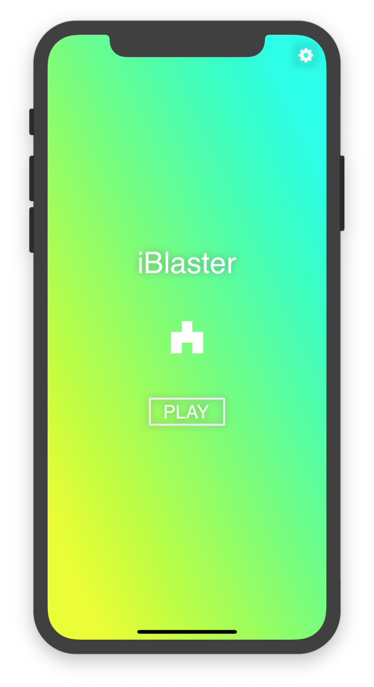
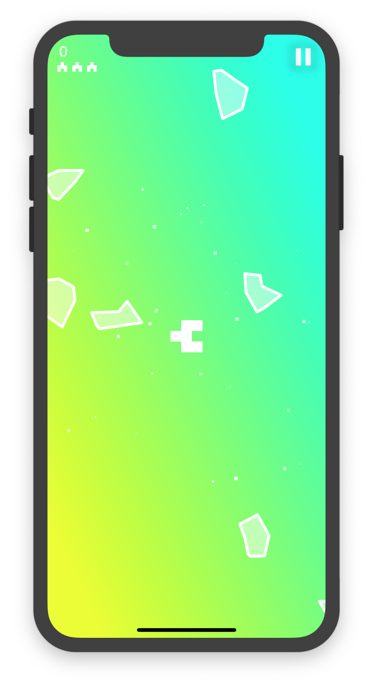

# iBlaster 👀 🚀 💥

A.K.A EyeBlaster: A simple asteroid game for iOS devices - with eye tracking.

If you think this might look exactly like every other asteroid shooter out there, you would be correct. Except there one small difference... you control the cannon with your eyes. Wherever you look/gaze at on the screen, that is where it will aim.\* Then, simply tap anywhere on the screen to shoot and destory the asteroids!

|                                    |                                    |                                    |
|    -------------------------:      |     -------------------------:     |     -------------------------:     |
|   |    |   |
|                                    |                                    |                                    |

Some screen recordings of the game in action can be found [here](../movs).

## Build and Run
Download/clone the repo to your computer and open the Xcode project found in the src/ folder. Build and run by pressing the play button in the top toolbar. If you want to run it on your actual iPhone (as opposed to a simulator on the computer), plug the device into the computer and select it from the drop down menu in the top left before clicking the play button.

## Contributors
- Connor Yass: yassck02@gmail.com

## Tools, Frameworks, Technologies
- Eye tracking: [ARKit](https://developer.apple.com/arkit/)
- UI Framework: [UIKit](https://developer.apple.com/documentation/uikit)
- IDE, testing: [Xcode](https://developer.apple.com/xcode/)

\* This feature is only supported by devices with FaceID. Other devices will use the accelerometer (tilt) to aim the cannon