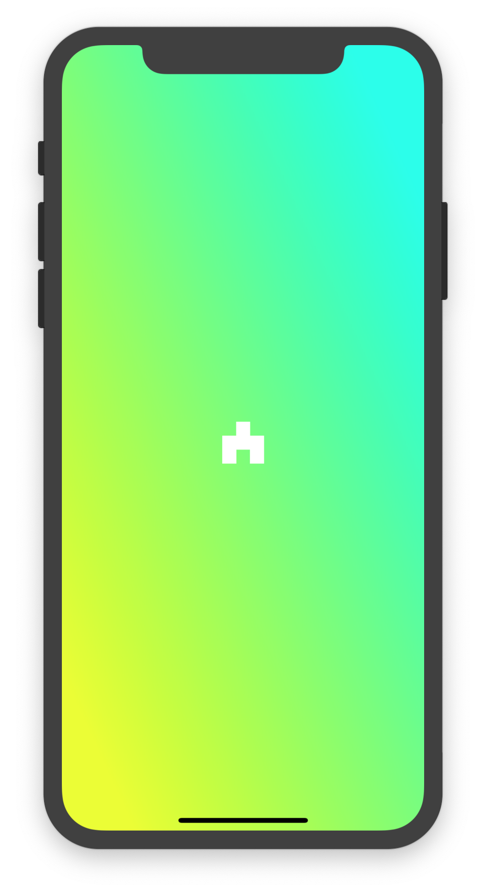

# iBlaster 👀 🚀 💥

A.K.A EyeBlaster: A simple asteroid game for iOS devices - with eye tracking.

If you think this might look exactly like every other asteroid shooter out there, you would be correct. 
Except there one small difference... you control the cannon with your eyes. 
Wherever you look/gaze at on the screen, that is where it will aim. 
Then, simply tap anywhere on the screen to shoot and destory the asteroids!

|                                    |                                    |                                    |
|    -------------------------:      |     -------------------------:     |     -------------------------:     |
|   |    |   |
|                                    |                                    |                                    |

## Contributors
- Connor Yass: yassck02@gmail.com

## Tools, frameworks, technologies
- Eye tracking: [ARKit](https://developer.apple.com/arkit/)
- UI Framework: [UIKit](https://developer.apple.com/documentation/uikit)
- IDE, testing: [Xcode](https://developer.apple.com/xcode/)
